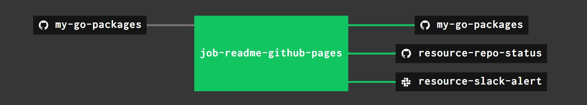

# my-go-packages

[](https://goreportcard.com/report/github.com/JeffDeCola/my-go-packages)
[](https://godoc.org/github.com/JeffDeCola/my-go-packages)
[](https://codeclimate.com/github/JeffDeCola/my-go-packages/maintainability)
[](https://codeclimate.com/github/JeffDeCola/my-go-packages/issues)
[](http://jeffdecola.mit-license.org)

`my-go-packages` is a place for me to create and use go packages.

* [MY GO PACKAGES](https://github.com/JeffDeCola/my-go-packages#my-go-packages)
  * [jeffshapes](https://github.com/JeffDeCola/my-go-packages#jeffshapes)

[GitHub Webpage](https://jeffdecola.github.io/my-go-packages/)

## MY GO PACKAGES

### jeffshapes

_jeffshapes package (below) makes it easy to compute area and circumference
of a circle._

* type Circle
  * func (c Circle) circleArea() float64
  * func (c Circle) circleCircumference() float64

Use,

```bash
import github.com/JeffDeCola/my-go-packages/jeffshapes
```

## UPDATE GITHUB WEBPAGE USING CONCOURSE (OPTIONAL)

For fun, I use concourse to update
[my-go-packages GitHub Webpage](https://jeffdecola.github.io/my-go-packages/)
and alert me of the changes via repo status and slack.

A pipeline file [pipeline.yml](https://github.com/JeffDeCola/my-go-packages/tree/master/ci/pipeline.yml)
shows the entire ci flow. Visually, it looks like,



The `jobs` and `tasks` are,

* `job-readme-github-pages` runs task
  [readme-github-pages.sh](https://github.com/JeffDeCola/my-go-packages/tree/master/ci/scripts/readme-github-pages.sh).

The concourse `resources types` are,

* `my-go-packages` uses a resource type
  [docker-image](https://hub.docker.com/r/concourse/git-resource/)
  to PULL a repo from github.
* `resource-slack-alert` uses a resource type
  [docker image](https://hub.docker.com/r/cfcommunity/slack-notification-resource)
  that will notify slack on your progress.
* `resource-repo-status` uses a resource type
  [docker image](https://hub.docker.com/r/dpb587/github-status-resource)
  that will update your git status for that particular commit.

For more information on using concourse for continuous integration,
refer to my cheat sheet on [concourse](https://github.com/JeffDeCola/my-cheat-sheets/tree/master/software/operations-tools/continuous-integration-continuous-deployment/concourse-cheat-sheet).
