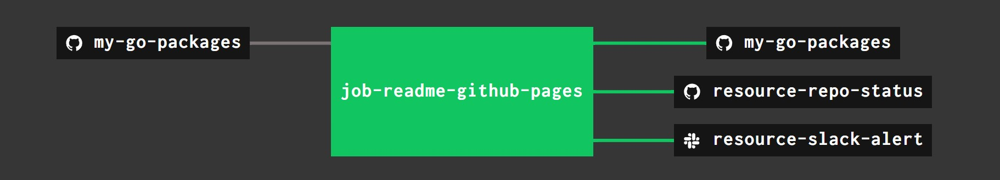

# CONCOURSE CONTINUOUS INTEGRATION

I use concourse ci to,

* Copy and edit `README.md` to `/docs/_includes/README.md` for
  [GitHub Webpage](https://jeffdecola.github.io/my-go-packages/)
* Alert me of the progress via repo status and slack

## PIPELINE

The concourse
[pipeline.yml](https://github.com/JeffDeCola/my-go-packages/blob/master/ci/pipeline.yml)
shows the entire ci flow. Visually, it looks like,

## JOBS, TASKS AND RESOURCE TYPES

The concourse `jobs` and `tasks` are,

* `job-readme-github-pages` runs task
  [task-readme-github-pages.yml](https://github.com/JeffDeCola/my-go-packages/blob/master/ci/tasks/task-readme-github-pages.yml)
  that kicks off shell script
  [readme-github-pages.sh](https://github.com/JeffDeCola/my-go-packages/blob/master/ci/scripts/readme-github-pages.sh)

The concourse `resources types` are,

* `my-go-packages` uses a resource type
  [docker-image](https://hub.docker.com/r/concourse/git-resource/)
  to PULL a repo from github
* `resource-slack-alert` uses a resource type
  [docker image](https://hub.docker.com/r/cfcommunity/slack-notification-resource)
  that will notify slack on your progress
* `resource-repo-status` uses a resource type
  [docker image](https://hub.docker.com/r/jeffdecola/github-status-resource-clone)
  that will update your git status for that particular commit

For more information on using concourse for continuous integration,
refer to my
[concourse-cheat-sheet](https://github.com/JeffDeCola/my-cheat-sheets/tree/master/software/operations/continuous-integration-continuous-deployment/concourse-cheat-sheet).
