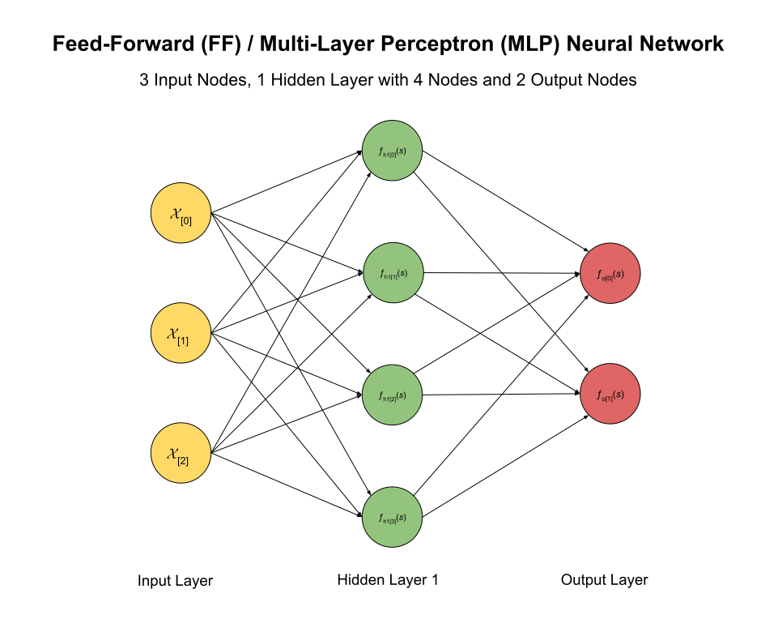
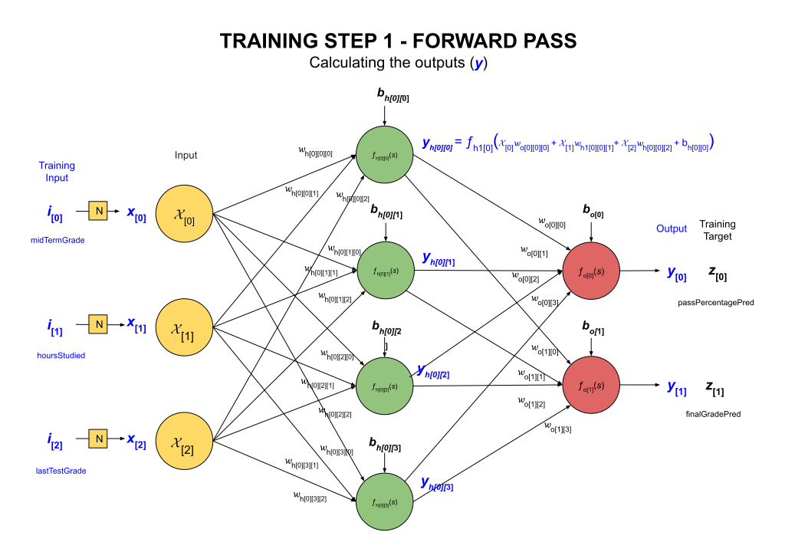
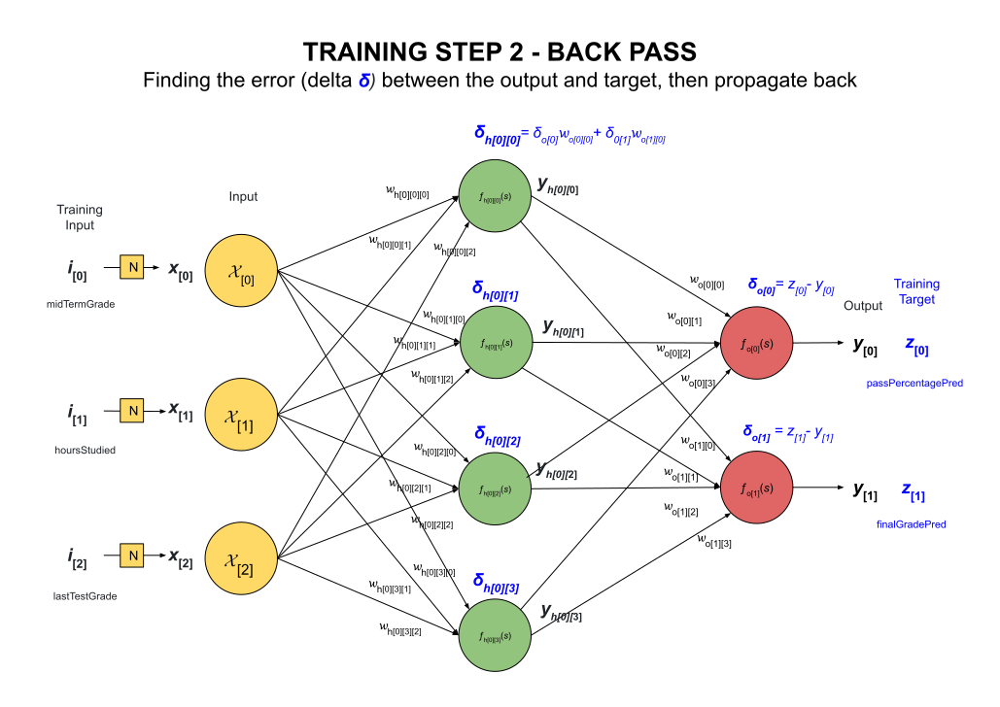
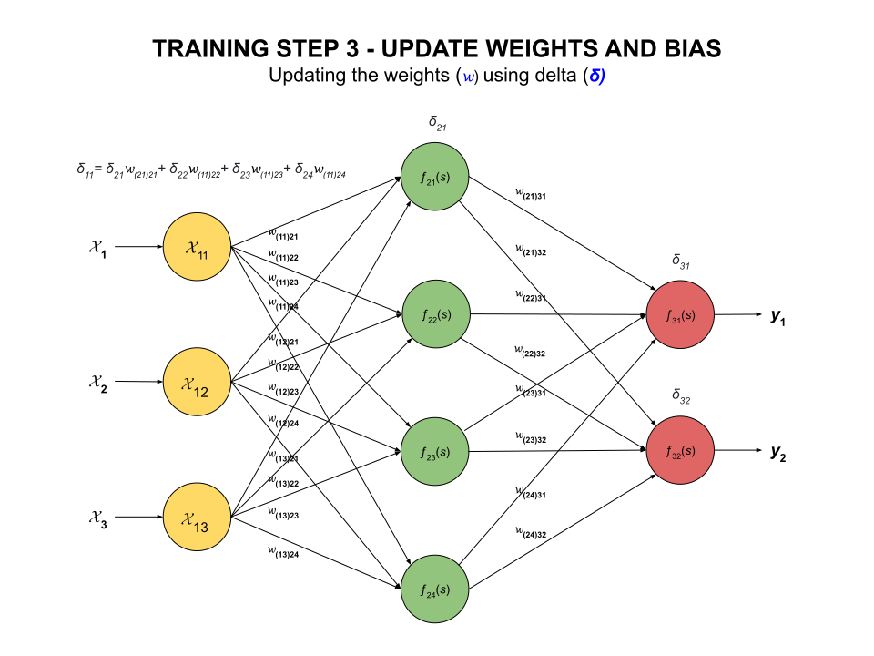

# MULTI-LAYER PERCEPTRON (MLP) PACKAGE

  _A package to implement a user scalable multi-layer
  perceptron (MLP) / feed-forward (FF) neural network using a
  sigmoid non-linear function._

TL;DR,

```go
nn := nnp.CreateNeuralNetwork()
nn.PrintNeuralNetwork()
nn.InitializeWeightsAndBias()
err := nn.GetInputMinMaxFromCSV()
nn.PrintInputMinMax()
err := nn.TrainNeuralNetwork()
```

Table of Contents

* [OVERVIEW](https://github.com/JeffDeCola/my-neural-networks/tree/main/multi-layer-perceptron-scalable#overview)
* [STEP 1 - CONFIGURE YOUR NEURAL NETWORK](https://github.com/JeffDeCola/my-neural-networks/tree/main/multi-layer-perceptron-scalable#step-1---configure-your-neural-network)
* [STEP 2 - CREATE NEURAL NETWORK](https://github.com/JeffDeCola/my-neural-networks/tree/main/multi-layer-perceptron-scalable#step-2---create-neural-network)
* [STEP 3 - INITIALIZE WEIGHTS & BIAS](https://github.com/JeffDeCola/my-neural-networks/tree/main/multi-layer-perceptron-scalable#step-3---initialize-weights--bias)
* [STEP 4 - CREATE YOUR DATASET](https://github.com/JeffDeCola/my-neural-networks/tree/main/multi-layer-perceptron-scalable#step-4---create-your-dataset)
* [STEP 5 - GET INPUT MID MAX VALUES OF YOUR DATASET](https://github.com/JeffDeCola/my-neural-networks/tree/main/multi-layer-perceptron-scalable#step-5---get-input-mid-max-values-of-your-dataset)
* [STEP 6 - TRAIN YOUR NEURAL NETWORK](https://github.com/JeffDeCola/my-neural-networks/tree/main/multi-layer-perceptron-scalable#step-6---train-your-neural-network)
  * [STEP 6.1 - READING THE CVS FILE](https://github.com/JeffDeCola/my-neural-networks/tree/main/multi-layer-perceptron-scalable#step-61---reading-the-cvs-file)
  * [STEP 6.2 - NORMALIZE INPUT DATA](https://github.com/JeffDeCola/my-neural-networks/tree/main/multi-layer-perceptron-scalable#step-62---normalize-input-data)
  * [STEP 6.3 - FORWARD PASS](https://github.com/JeffDeCola/my-neural-networks/tree/main/multi-layer-perceptron-scalable#step-63---forward-pass)
  * [STEP 6.4 - BACKWARD PASS](https://github.com/JeffDeCola/my-neural-networks/tree/main/multi-layer-perceptron-scalable#step-64---backward-pass)
  * [STEP 6.5 - UPDATE WEIGHTS & BIAS](https://github.com/JeffDeCola/my-neural-networks/tree/main/multi-layer-perceptron-scalable#step-65---update-weights--bias)

Documentation and Reference

* [artificial intelligence](https://github.com/JeffDeCola/my-cheat-sheets/tree/master/software/development/software-architectures/artificial-intelligence/artificial-intelligence-cheat-sheet)
cheat sheet
* [neural networks](https://github.com/JeffDeCola/my-cheat-sheets/tree/master/software/development/software-architectures/artificial-intelligence/artificial-intelligence-cheat-sheet/neural-networks.md)
cheat sheet
* [my-neural-networks](https://github.com/JeffDeCola/my-neural-networks/tree/main)
  * [perceptron-simple-example](https://github.com/JeffDeCola/my-neural-networks/tree/main/perceptron-simple-example)
  * [mlp-classification-example](https://github.com/JeffDeCola/my-neural-networks/tree/main/mlp-classification-example)
  * [mlp-image-recognition-example](https://github.com/JeffDeCola/my-neural-networks/tree/main/mlp-regression-example)
  * [mlp-regression-example](https://github.com/JeffDeCola/my-neural-networks/tree/main/mlp-image-recognition-example)
* [the-math-behind-training-mlp-neural-networks](https://github.com/JeffDeCola/my-cheat-sheets/tree/master/software/development/software-architectures/artificial-intelligence/artificial-intelligence-cheat-sheet/neural-networks.md)

## OVERVIEW

A  multi-layer perceptron (MLP) / feed-forward (FF)
neural network has the following structure,

* The input layer
* The hidden layer(s)
* The output layer

As an example, a neural network with 3 input nodes, 1 hidden layer
with 4 nodes and 2 output nodes would look like,



## STEP 1 - CONFIGURE YOUR NEURAL NETWORK

In this package you can configure your multi-layer
perceptron (MLP) / feed-forward (FF)
neural network by setting the following parameters,

* The number of input nodes
* The input node labels
* The number of hidden layers
* The number of nodes in each hidden layer
* The number of output nodes
* The output node labels
* The learning rate $\eta$
* The number of epochs $E$
* The loss function _MSE (Mean Squared Error) or CE (Cross Entropy)_
* The dataset CSV file

As an example, you would do this by creating a
`NeuralNetworkParameters` struct,

```go
nnp := mlp.NeuralNetworkParameters{
  InputNodes:          3,
  InputNodeLabels:     []string{"midterm-grade", "hours-studied", "last-test-grade"},
  HiddenLayers:        3,
  HiddenNodesPerLayer: []int{4, 4, 4},
  OutputNodes:         2,
  OutputNodeLabels:    []string{"pred-perc-passing-final", "pred-final-grade"},
  LearningRate:        0.1,
  Epochs:              4,
  LossFunction:        "MSE",
  DatasetCSVFile:      "dataset.csv",
}
```

## STEP 2 - CREATE NEURAL NETWORK

To create a neural network, you take your parameters and feed them
into the `CreateNeuralNetwork` method,

```go
nn := nnp.CreateNeuralNetwork()
```

You can also print out the neural network structure if you want,

```go
nn.PrintNeuralNetwork()
```

## STEP 3 - INITIALIZE WEIGHTS & BIAS

Now you need to initialize the weights and bias for the neural network.
This will set the initial weights and bias to random values between -1 and 1.
This is done by calling the `InitializeWeightsAndBias` method,

```go
nn.InitializeWeightsAndBias()
```

## STEP 4 - CREATE YOUR DATASET

You will use a standard csv file with the first row being the labels
and the rest of the rows being the input and target output data.
It will look something like this,

```csv
midterm-grade,hours-studied,last-test-grade,pred-perc-passing-final,pred-final-grade
89,48,79,80,82
75,23,85,70,78
etc...
```

## STEP 5 - GET INPUT MID MAX VALUES OF YOUR DATASET

Before you start training, we need to find the min and max values
of your dataset (your csv file). The min and max values will be
used to normalize your dataset.
This is done by calling the `GetInputMinMaxFromCSV` method,

```go
err := nn.GetInputMinMaxFromCSV()
if err != nil {
  fmt.Println("Error:", err)
  return
}
```

You can print out the min and max values if you want,

```go
nn.PrintInputMinMax()
```

## STEP 6 - TRAIN YOUR NEURAL NETWORK

Now that out neural network is setup and we have our dataset,
we can train our neural network.
To put it simple, training a neural network is
the process of adjusting the weights
of the network in order to minimize the loss in the output from
the network.
To achieve this we use a optimization technique called **Stochastic Gradient Descent**.
We calculate loss using a loss function and calculate the derivate and we update
the weights during backpropagation. The main goal is to minimize
the difference(loss) between predicted output and actual output.
MLP uses a supervised learning technique called **backpropagation** for training.
In our case, we will call the `TrainNeuralNetwork` method,

```go
err := nn.TrainNeuralNetwork()
if err != nil {
  fmt.Println("Error:", err)
  return
}
```

This one method does a lot of heavy lifting so let's break it down.
If you're not interested in these details, you can skip to step 7.

### STEP 6.1 - READING THE CVS FILE

We will not store the csv file in memory, but rather read it line by line.
This is because the csv file could be very large.
But it will take a little longer to train. This is the trade off.

```go
ch := nn.readCSVFileLineByLine()
```

The channel `ch` will contain each line of the csv file.

### STEP 6.2 - NORMALIZE INPUT DATA

Normalization, also called min-max scaling, changes the values of
input data set to occupy a range of [0, 1] or [-1, 1],
reducing the influence of unusual values of out model.
We will normalize the input data between 0 and 1.
The formula is,

$$
normalized\ dataset = \frac{data - min(dataset)}{max(dataset) - min(dataset)}
$$

where

* $data$ is the input data
* $min(dataset)$ is the minimum value of the dataset
* $max(dataset)$ is the maximum value of the dataset

For example if our input data set is

$$
{85 100\ 69\ 72\ 99\ 95}
$$

where the min is 69 and the max is 100.

Hence, for the first input of 85 would be normalized to,

$$
\frac{85 - 69}{100 - 69} = \frac{16}{31} = 0.516129
$$

We will normalize using the `normalize` function,

```go
data = nn.normalizeInputData(data)
```

### STEP 6.3 - FORWARD PASS

Giving our normalized $x_{[0]}$, $x_{[1]}$ and $x_{[2]}$ input training data,
**compute the output for each layer and
propagate through layers to obtain the outputs
$y_{[0]}$ and $y_{[1]}$**.



Calculate the hidden layer outputs,

$$
\begin{aligned}
y_{h[0][0]} &= f_{h[0][0]}(s) = f_{h[0][0]}\left(x_{[0]} w_{h[0][0][0]} + x_{[1]} w_{h[0][0][1]} + x_{[2]} w_{h[0][0][2]} + b_{h[0][0]}\right) \\
y_{h[0][1]} &= f_{h[0][1]}(s) = f_{h[0][1]}\left(x_{[0]} w_{h[0][1][0]} + x_{[1]} w_{h[0][1][1]} + x_{[2]} w_{h[0][1][2]} + b_{h[0][1]}\right) \\
y_{h[0][2]} &= f_{h[0][2]}(s) = f_{h[0][2]}\left(x_{[0]} w_{h[0][2][0]} + x_{[1]} w_{h[0][2][1]} + x_{[2]} w_{h[0][2][2]} + b_{h[0][2]}\right) \\
y_{h[0][3]} &= f_{h[0][3]}(s) = f_{h[0][3]}\left(x_{[0]} w_{h[0][3][0]} + x_{[1]} w_{h[0][3][1]} + x_{[2]} w_{h[0][3][2]} + b_{h[0][3]}\right)
\end{aligned}
$$

Finally, calculate the outputs,

$$
\begin{aligned}
y_{[0]} &= f_{o[0]}(s) = f_{o[0]}\left(y_{h[0][0]} w_{o[0][0]} + y_{h[0][1]} w_{o[0][1]} + y_{h[0][2]} w_{o[0][2]} + y_{h[0][3]} w_{o[0][3]} + b_{o[0]}\right) \\
y_{[1]} &= f_{o[1]}(s) = f_{o[1]}\left(y_{h[0][0]} w_{o[1][0]} + y_{h[0][1]} w_{o[1][1]} + y_{h[0][2]} w_{o[1][2]} + y_{h[0][3]} w_{o[1][3]} + b_{o[1]}\right) \\
\end{aligned}
$$

where $f(s)$ is the
[sigmoid function](https://github.com/JeffDeCola/my-cheat-sheets/tree/master/other/stem/math/pure/changes/calculus-cheat-sheet#the-sigmoid-function).

$$
f(s) = \sigma(s) = \frac{1}{1 + e^{-s}}
$$

The method `forwardPass` does this,

```go
yOutput, yHidden := nn.forwardPass(x)
```

### STEP 6.4 - BACKWARD PASS

Now  that we have the outputs $y$, calculate the error (delta **$\delta$**)
between target data ($z$) and actual output ($y$)
and propagate backwards.



The output error,

$$
\begin{aligned}
\delta_{[0]} &= z_{[0]} - y_{[0]} \\
\delta_{[1]} &= z_{[1]} - y_{[1]}
\end{aligned}
$$

The hidden layer error,

$$
\begin{aligned}
\delta_{h[0][0]} &= \delta_{o[0]} w_{o[0][0]} + \delta_{o[1]} w_{o[1][0]} \\
\delta_{h[0][1]} &= \delta_{o[0]} w_{o[0][1]} + \delta_{o[1]} w_{o[1][1]} \\
\delta_{h[0][2]} &= \delta_{o[0]} w_{o[0][2]} + \delta_{o[1]} w_{o[1][2]} \\
\delta_{h[0][3]} &= \delta_{o[0]} w_{o[0][3]} + \delta_{o[1]} w_{o[1][3]}
\end{aligned}
$$

The method `backwardPass` does this,

```go
deltaOutput, deltaHidden := nn.backwardPass(yOutput, yHidden, z)
```

## STEP 6.5 - UPDATE WEIGHTS & BIAS

Update the weights using the error (delta $\delta$) and the learning rate $\alpha$.



The new weights,

$$
\begin{aligned}
w_{o[0][0]} &= w_{o[0][0]} + \alpha \delta_{o[0]} y_{h[0][0]} \\
\end{aligned}
$$
