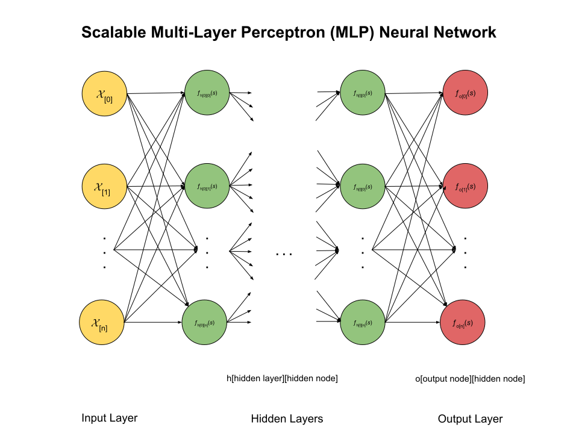

# MULTI-LAYER PERCEPTRON (MLP) PACKAGE

_A package to implement a scalable multi-layer
perceptron (MLP) neural network._

TL;DR,

```go
nn := nnp.CreateNeuralNetwork()
nn.PrintNeuralNetwork()


// FOR TRAINING


// FOR TESTING

//FOR PREDICTING

err := nn.GetInputMinMaxFromCSV()
nn.PrintInputMinMax()
err = nn.InitializeNeuralNetwork()
err := nn.TrainNeuralNetwork()
```

Table of Contents

Documentation and Reference

* [artificial intelligence](https://github.com/JeffDeCola/my-cheat-sheets/tree/master/software/development/software-architectures/artificial-intelligence/artificial-intelligence-cheat-sheet)
* [neural networks](https://github.com/JeffDeCola/my-cheat-sheets/tree/master/software/development/software-architectures/artificial-intelligence/artificial-intelligence-cheat-sheet/neural-networks.md)
* [my-neural-networks](https://github.com/JeffDeCola/my-neural-networks/tree/main)
  * [the-math-behind-training-mlp-neural-networks](https://github.com/JeffDeCola/my-neural-networks/tree/main/math/the-math-behind-training-mlp-neural-networks)
  * [mlp-classification-example](https://github.com/JeffDeCola/my-neural-networks/tree/main/mlp/mlp-classification-example)
  * [mlp-image-recognition-example](https://github.com/JeffDeCola/my-neural-networks/tree/main/mlp/mlp-regression-example)
  * [mlp-regression-example](https://github.com/JeffDeCola/my-neural-networks/tree/main/mlp/mlp-image-recognition-example)
  * [perceptron-simple-example](https://github.com/JeffDeCola/my-neural-networks/tree/main/perceptron/perceptron-simple-example)
* [calculus](https://github.com/JeffDeCola/my-cheat-sheets/tree/master/other/stem/math/pure/changes/calculus-cheat-sheet)
  * [differential equations](https://github.com/JeffDeCola/my-cheat-sheets/tree/master/other/stem/math/pure/changes/calculus-cheat-sheet/differential-equations-cheat-sheet)

## OVERVIEW

This go package can create a multi-layer perceptron (MLP) neural
network which has the following structure,

* An Input Layer
* Multiple Hidden Layers
* An Output Layer



There are 3 modes of operation,

* Training
* Testing
* Predicting

All the math used in the go package is explained in my cheat sheet
[the-math-behind-training-mlp-neural-networks](https://github.com/JeffDeCola/my-cheat-sheets/blob/master/software/development/software-architectures/artificial-intelligence/artificial-intelligence-cheat-sheet/the-math-behind-training-mlp-neural-networks.md).

## CONFIGURATION STRUCT

To create your neural network for any mode of operation,
you first create a configuration struct
which contains all the parameters that defines your neural network.

```go
// Neural Network Configuration Parameters
type NeuralNetworkConfiguration struct {
    Mode                         string // "training", "testing" or "predicting"
    InputNodes                   int
    InputNodeLabels              []string
    HiddenLayers                 int // Also update HiddenNodesPerLayer
    HiddenNodesPerLayer          []int
    OutputNodes                  int
    OutputNodeLabels             []string
    Epochs                       int
    LearningRate                 float64
    ActivationFunction           string // "sigmoid" or "tanh"
    LossFunction                 string // "mean-squared-error"
    InitWeightsBiasesMethod      string // "file" or "random"
    InitWeightsBiasesJSONFile    string
    MinMaxInputMethod            string // "file" or "calculate" from TrainingDatasetCSVFile
    MinMaxOutputMethod           string // "file" or "calculate" from TrainingDatasetCSVFile
    MinMaxJSONFile               string // from SaveMinMaxValuesToJSON()
    TrainingDatasetCSVFile       string
    NormalizeInputData           bool
    NormalizeOutputData          bool
    NormalizeMethod              string // "zero-to-one" or "minus-one-to-one
    TrainedWeightsBiasesJSONFile string // from SaveWeightsBiasesToJSON()
    TestingDatasetCSVFile        string
}
```

The structure of the neural network is defined by the following parameters,

* `InputNodes` - The number of input nodes
* `InputNodeLabels` - The labels of the input nodes
* `HiddenLayers` - The number of hidden layers
* `HiddenNodesPerLayer` - The number of nodes in each hidden layer
* `OutputNodes` - The number of output nodes
* `OutputNodeLabels` - The labels of the output nodes


## CREATE YOUR NEURAL NETWORK

To create a neural network, you setup a
configuration struct and feed them into the `CreateNeuralNetwork`
method which will return a
`NeuralNetwork` struct.

```go
nn := nnp.CreateNeuralNetwork()
```


## INITIALIZE YOUR NEURAL NETWORK

To initialize your neural network, you call the `InitializeNeuralNetwork` method,

```go
err := nn.InitializeNeuralNetwork()
```

This will initialize the weights and biases of the network.
It will either load them from a file or initialize them randomly.

You can also print out the neural network structure if you would like,

```go
nn.PrintNeuralNetwork()
```

## TRAINING

The goal of training is to adjust the weights and biases of the network
in order to minimize the loss in the output from the network.

### CONFIGURE FOR TRAINING

As an example you may want to use the following parameters,

```go
nnp := mlp.NeuralNetworkConfiguration{
  InputNodes:              2,
  InputNodeLabels:         []string{"midterm-grade", "hours-studied", "last-test-grade"},
  HiddenLayers:            1,
  HiddenNodesPerLayer:     []int{3},
  OutputNodes:             1,
  OutputNodeLabels:        []string{"predicted-percentage-passing-final", "predicted-final-grade"},
  Epochs:                  100,
  DatasetCSVFile:          "dataset.csv",
  Initialization:          "file",               // or "random"
  WeightsAndBiasesCSVFile: "weights-and-biases.csv",
  NormalizeInputData:      true,                 // or false
  NormalizeMethod:         "zero-to-one",        // or "minus-one-to-one"
  ActivationFunction:      "sigmoid",            // or "tanh"
  LossFunction:            "mean-squared-error", // or "cross-entropy"
  LearningRate:            0.1,
}
```

### CREATE YOUR TRAINING DATASET FILE

You will use a standard csv file with the first row being the labels
and the rest of the rows being the input and target output data.
For example, a dataset could look something like this,

```csv
X1, x2, x3, y1, y2
89,48,79,80,82
75,23,85,70,78
...
```

## TESTING

The goal of testing is to evaluate the performance of the network by
using a separate dataset that was not used during training.

### CONFIGURE FOR TESTING

As an example you may want to use the following parameters,

```go
nnp := mlp.NeuralNetworkConfiguration{
  InputNodes:              2,
  InputNodeLabels:         []string{"midterm-grade", "hours-studied", "last-test-grade"},
  HiddenLayers:            1,
  HiddenNodesPerLayer:     []int{3},
  OutputNodes:             1,
  OutputNodeLabels:        []string{"predicted-percentage-passing-final", "predicted-final-grade"},
  Epochs:                  100,
  DatasetCSVFile:          "dataset.csv",
  Initialization:          "file",               // or "random"
  WeightsAndBiasesCSVFile: "weights-and-biases.csv",
  NormalizeInputData:      true,                 // or false
  NormalizeMethod:         "zero-to-one",        // or "minus-one-to-one"
  ActivationFunction:      "sigmoid",            // or "tanh"
  LossFunction:            "mean-squared-error", // or "cross-entropy"
  LearningRate:            0.1,
}
```

## PREDICTING

The goal of predicting is to use the trained network to predict the output
for new input data.

### CONFIGURE FOR PREDICTING

As an example you may want to use the following parameters,

```go
nnp := mlp.NeuralNetworkConfiguration{
  InputNodes:              2,
  InputNodeLabels:         []string{"midterm-grade", "hours-studied", "last-test-grade"},
  HiddenLayers:            1,
  HiddenNodesPerLayer:     []int{3},
  OutputNodes:             1,
  OutputNodeLabels:        []string{"predicted-percentage-passing-final", "predicted-final-grade"},
  Epochs:                  100,
  DatasetCSVFile:          "dataset.csv",
  Initialization:          "file",               // or "random"
  WeightsAndBiasesCSVFile: "weights-and-biases.csv",
  NormalizeInputData:      true,                 // or false
  NormalizeMethod:         "zero-to-one",        // or "minus-one-to-one"
  ActivationFunction:      "sigmoid",            // or "tanh"
  LossFunction:            "mean-squared-error", // or "cross-entropy"
  LearningRate:            0.1,
}
```


## GET INPUT MID MAX VALUES OF YOUR DATASET

Before you start training, we need to find the min and max values
of your dataset (your csv file). The min and max values will be
used to normalize your dataset.
This is done by calling the `GetInputMinMaxFromCSV` method,

```go
err := nn.GetInputMinMaxFromCSV()
```

You can print out the min and max values if you want,

```go
nn.PrintInputMinMax()
```

You chose what the filename is in the `NeuralNetworkParameters` struct,

```go
DatasetCSVFile: "filename.csv",
```

## STEP 1 - INITIALIZATION

The first step in training a neural network is to initialize the weights
and bias. You can read the weights and bias from a json file or initialize them
randomly.

```go
err = nn.InitializeNeuralNetwork()
```

You chose how to initialize the weights and biases in the
`NeuralNetworkParameters` struct,

```go
Initialization:          "file" |  "random"
```

## THE TRAINING LOOP

Now that out neural network is configured and we have our dataset,
we can train our neural network.
To put it simple, training a neural network is
the process of adjusting the weights
of the network in order to minimize the loss in the output from
the network.
To achieve this we use a optimization technique called **Stochastic Gradient Descent**.
We calculate loss using a loss function and calculate the derivate and we update
the weights during backpropagation. The main goal is to minimize
the difference(loss) between predicted output and actual output.
MLP uses a supervised learning technique called **backpropagation** for training.
In our case, we will call the `TrainNeuralNetwork` method,

```go
err := nn.TrainNeuralNetwork()
```

This one method does a lot of heavy lifting so let's break it down.
If you're not interested in these details, you can skip to step 7.

There are two loops in the `TrainNeuralNetwork` method,

1. The outer loop is the number of epochs $E$.
2. The inner loop is the number of rows in the dataset.

```go
nn.epochLoop()
```

which calls the datasetLoop method,

```go
nn.datasetLoop()
```

You can set the number of epochs in the `NeuralNetworkParameters` struct,

```go
Epochs:       #
```

### READING THE CVS DATASET FILE

We will not store the csv file in memory, but rather read it line by line.
This is because the csv file could be very large.
But it will take a little longer to train. This is the trade off.

```go
ch := nn.readCSVFileLineByLine()
```

The channel `ch` will contain each line of the csv file.

You chose what the filename is in the `NeuralNetworkParameters` struct,

```go
DatasetCSVFile: "filename.csv",
```

### STEP 2 - NORMALIZATION

Normalization, also called min-max scaling, changes the values of
input data set to occupy a range of [0, 1] or [-1, 1],
reducing the influence of unusual values of out model.
We will normalize the input data between 0 and 1.
This is done by the `normalizeInputData` method.

```go
data = nn.normalizeInputData(data)
```

You may turn normalization on/off and chose the method
in the `NeuralNetworkParameters` struct,

```go
NormalizeInputData: true | false
NormalizeMethod:    "zero-to-one" | "minus-one-to-one"
```

### STEP 3 - FORWARD PASS

Giving our normalized $x_{[0]}$, $x_{[1]}$ and $x_{[2]}$ input training data,
**compute the output for each layer and
propagate through layers to obtain the outputs
$y_{[0]}$ and $y_{[1]}$**.

The method `forwardPass` does this,

```go
yOutput, yHidden := nn.forwardPass(x)
```

You may chose the activation function in the `NeuralNetworkParameters` struct,

```go
ActivationFunction: "sigmoid" | "tanh"
```

### STEP 4 - BACKWARD PASS

Now  that we have the outputs $y$, calculate the error (delta **$\delta$**)
between target data ($z$) and actual output ($y$)
and propagate backwards.

### STEP 5 - UPDATE WEIGHTS & BIASES

## STEP 6 - SAVE WEIGHTS & BIASES

## ADD TO YOUR GO.MOD

Since each package is tagged independently,

```text
git tag neural-networks/mlp/vX.X.X
git push --tags
```

Add this to your go.mod file,

```text
require github.com/JeffDeCola/my-go-packages/neural-networks/mlp vX.X.X
```
